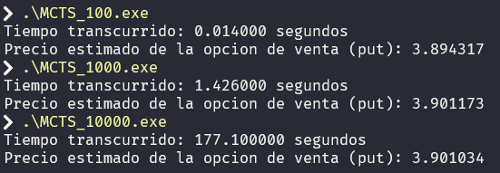
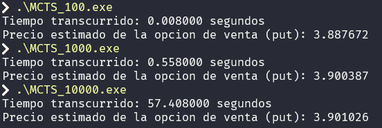
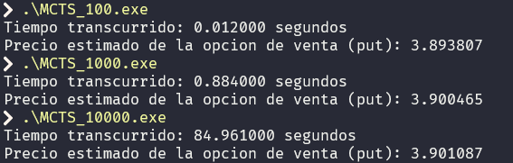
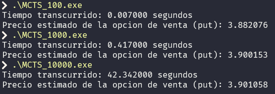

# Trabajo Final - Simulación paralela de Monte Carlo

## Integrantes:
- Kevin Alexis Prada Morales - 2191928
- Ronald Arias Manrique - 2191927

**Vídeo explicativo:** https://youtu.be/J336oQCJYRY

Este repositorio aborda la simulación de árbol de búsqueda Monte Carlo para estimar el valor de problemas matemáticos complejos, como la fijación de precios de opciones.

## ¿Qué es Monte Carlo Tree Search (MCTS)?

El MCTS(Árbol de búsqueda Monte Carlo) es un algoritmo de búsqueda heurística utilizado para tomar decisiones óptimas en un espacio de búsqueda probabilístico. Es ampliamente utilizado en juegos de estrategia como Go y ajedrez, así como en problemas de optimización y toma de decisiones.

Las fases principales del algoritmo son:

1. **Selección:** esta fase describe cómo el algoritmo comienza en el nodo raíz y selecciona nodos sucesivos, buscando un equilibrio entre exploración y explotación.
2. **Expansión:** Explica cómo se añaden nuevos nodos al árbol para explorar posibles futuros estados o movimientos.
3. **Simulación:** Detalla cómo se realizan simulaciones desde los nodos expandidos para obtener una estimación de su valor.
4. **Retropropagación:** Describe cómo se actualizan los nodos padres con los resultados de las simulaciones para mejorar la estimación de los valores de los nodos.

A continuación, se presenta una ilustración de un ejemplo del funcionamiento del algoritmo:


## Opciones financieras

Las opciones financieras son contratos derivados que otorgan al comprador el derecho, pero no la obligación, de comprar (llamada opción de compra o "call") o vender (llamada opción de venta o "put") un activo subyacente a un precio predeterminado (precio de ejercicio o "strike") en o antes de una fecha específica (vencimiento). El vendedor de la opción, por otro lado, tiene la obligación de cumplir con la transacción si el comprador decide ejercer su derecho.

### Factores en las opciones financieras

El precio de una opción, conocido como prima, se ve afectado por varios factores:

1. **Precio del Activo Subyacente:** El valor actual del activo sobre el cual se emite la opción.
2. **Precio de Ejercicio:** El precio al cual el comprador de la opción puede comprar o vender el activo subyacente.
3. **Tiempo hasta el Vencimiento:** Generalmente, cuanto más tiempo hasta el vencimiento, mayor es el valor de la opción.
4. **Volatilidad:** La volatilidad del activo subyacente afecta la probabilidad de que la opción termine "in the money" (con valor).
5. **Tasas de Interés:** Las tasas de interés afectan el costo de oportunidad de mantener una posición en opciones.
6. **Dividendos:** Para las opciones sobre acciones, los dividendos esperados pueden influir en el precio de las opciones

## Contenido del Repositorio

1. **MCTS.c:** Implementación en C del algoritmo de Monte Carlo Tree Search (MCTS) para valoración de opciones financieras de venta (put). No utiliza OpenMP para paralelizar.
2. **MCTS_OpenMP.c:** Implementa el algoritmo MCTS para valorar opciones financieras de venta. Utiliza OpenMP para paralelizar la simulación Monte Carlo y mejorar la eficiencia del cálculo.
3. **Makefile:** Archivo de configuración del sistema de construcción (make) que compila el código fuente paralelizado y gestionar las dependencias.
4. First list item
   - Configuración
     - CC: Compilador (gcc).
	 - CFLAGS: Opciones del compilador (-Wall -fopenmp).
	 - LDFLAGS: Opciones del enlazador (-lm).
	 - APPNAME: Nombre del ejecutable (MCTS_OpenMP).
	 - EXT: Extensión de los archivos de código fuente (.c).
	 - SRCDIR: Directorio de código fuente (src).
	 - OBJDIR: Directorio de objetos compilados (obj).
	 - BINDIR: Directorio de ejecutables (bin).
5. **openmp_mcts.sbatch:** Script de lote para la ejecución de un trabajo en el clúster con OpenMP. _Especifica el nombre del trabajo, nodos, tareas, núcleos por tarea y archivos de salida/error._

## ¿Dónde aplicamos la paralelización?

la paralelización se ha aplicado a la función simulateMonteCarlo, específicamente al bucle for que realiza las simulaciones de Monte Carlo. La razón de la paralelización es que cada simulación es independiente de las demás, lo que significa que se pueden realizar simultáneamente sin afectar el resultado final. 

```cpp
#pragma omp parallel for reduction(+:totalPayoff)
    for (int i = 0; i < numSims; ++i) {
        double discountedPayoff = simulateOptionPricing(S, K, T, r, sigma);
        totalPayoff += discountedPayoff;
    }
```
La directiva **`#pragma omp parallel for reduction(+:totalPayoff)`** utilizada en el bucle for es una directiva de OpenMP que instruye al compilador para que paralelice el bucle. La cláusula **`reduction(+:totalPayoff)`** asegura que la variable totalPayoff, que acumula los resultados de las simulaciones individuales, se maneje de manera segura en un entorno de múltiples hilos, sumando correctamente los resultados individuales de cada hilo en la variable compartida totalPayoff, lo que contribuye a una mejora en el rendimiento general del algoritmo.

## Cómo ejecutar

Para compilar y ejecutar el programa, se deben seguir estos pasos:

1. **Clonar el Repositorio**
2. **Entorno clúster:** Se debe ejecutar bajo un entorno de clúster gestionado por SLURM, para ello utilizamos:

```srun -n 8 --pty /bin/bash```

3. **Compilar el Programa:** Utilizar el Makefile para compilar el programa. Para eso hay que abrir una terminal y ejecutar el siguiente comando:

```make```

4. **Ejecutarlo:** Después de compilar, se puede ejecutar con el siguiente comando:

```.\MCTS_OpenMP```

## Evaluación del Código: sin paralelizar y paralelizado (resultados)

Tanto el código sin paralelizar como el paralelizado se corrieron en un PC común pero también en el servidor Guane:

**Configuración del Equipo Local:**
- Procesador: AMD Ryzen 3 2200G 3.50 GHz.
- Tarjeta Gráfica: Radeon Vega 8 Graphics (2GB VRAM).
- RAM: 16 GB.
- Sistema Operativo: Windows 10.

#### Resultados Sin Paralelizar: 
| Iteraciones | Simulaciones | Tiempo PC Local (s) | Tiempo Guane (s) |
|--------------|--------------|----------------------|------------------|
| 100          | 1,000        | 0.014               | 0.008            |
| 1,000        | 10,000       | 1.426               | 0.558            |
| 10,000       | 100,000      | 177.100             | 57.408           |

#### Imágenes Sin Paralelizar
- **En el equipo local**


- **En el servidor Guane**


#### Resultados Con Paralelización: 

| Iteraciones | Simulaciones | Tiempo PC Local (s) | Tiempo Guane (s) |
|--------------|--------------|----------------------|------------------|
| 100          | 1,000        | 0.012               | 0.007            |
| 1,000        | 10,000       | 0.884               | 0.417            |
| 10,000       | 100,000      | 84.961              | 42.342           |

#### Imágenes Con Paralelización:
- **En el equipo local**


- **En el servidor Guane**



### Observaciones y Conclusiones:

1. En general, los tiempos de ejecución con OpenMP son significativamente más bajos en comparación con los tiempos sin paralelización. Esto indica que la paralelización ha mejorado la eficiencia y acelerado la ejecución del código en ambas plataformas, tanto en el PC local como en el Servidor Guane.
2. En los casos de `100` iteraciones y `1000` simulaciones, el impacto de la paralelización es menor, pero aún se observa una mejora en el rendimiento.
3. A medida que aumenta la complejidad con `1000` iteraciones y `10000` simulaciones, así como con `10000` iteraciones y `100000` simulaciones, la paralelización tiene un impacto más significativo en la reducción de los tiempos de ejecución.


## Referencias

Este proyecto se basa en el trabajo original de [Michael Bzms](https://github.com/michaelbzms), cuyo repositorio original se puede encontrar en [https://github.com/michaelbzms/MonteCarloTreeSearch](https://github.com/michaelbzms/MonteCarloTreeSearch). Se agradece a Michael Bzms por proporcionar la implementación inicial del algoritmo Monte Carlo Tree Search (MCTS) en C++.

La versión presente en este repositorio ha sido modificada para introducir paralelismo y optimizaciones mediante el uso de OpenMP.

[Repositorio Original de Michael Bzms](https://github.com/michaelbzms/MonteCarloTreeSearch)
