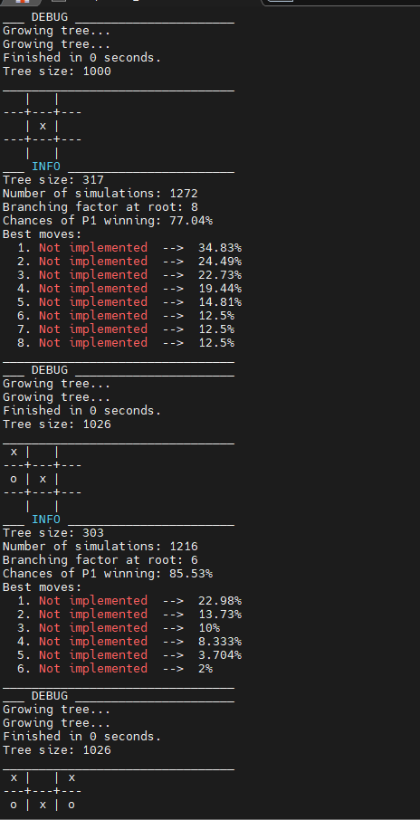
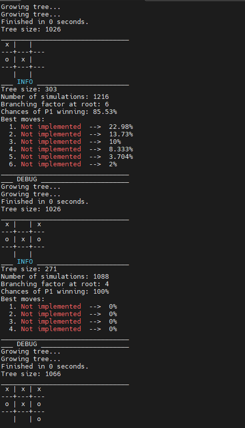
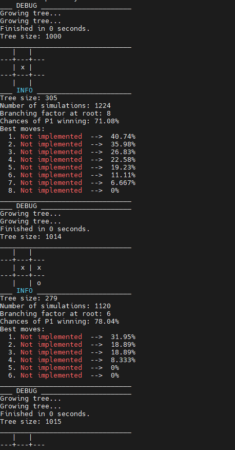
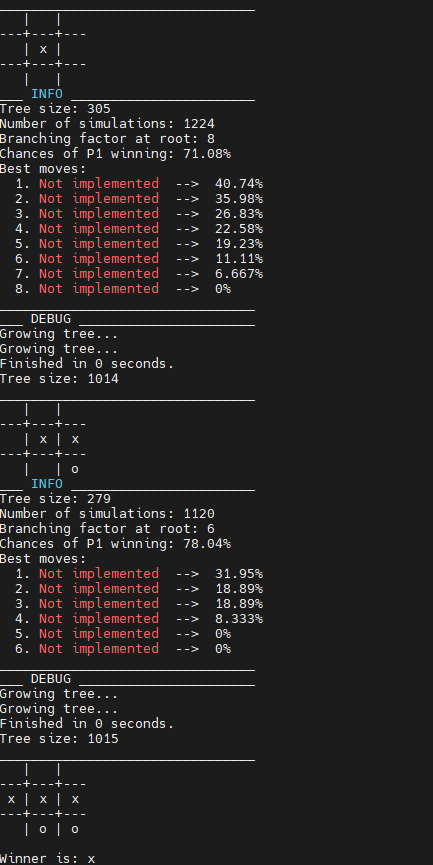

# Trabajo Final - Optimización de Monte Carlo Tree Search (MCTS) con OpenMP

Este repositorio aborda el objetivo de paralelizar y optimizar el método de Monte Carlo Tree Search (MCTS) mediante el uso de OpenMP. MCTS es comúnmente utilizado en la toma de decisiones en entornos de inteligencia artificial y juegos.

## ¿Qué es Monte Carlo Tree Search (MCTS)?

Monte Carlo Tree Search (MCTS) es un algoritmo de búsqueda basado en la simulación de juegos. Se utiliza para la toma de decisiones en situaciones donde el espacio de búsqueda es muy grande y no se puede explorar completamente. MCTS ha demostrado ser eficaz en juegos de estrategia y otras áreas de inteligencia artificial.

El proceso de MCTS se divide en varias fases:
1. **Selección:** Selecciona nodos en el árbol basándose en algún criterio.
2. **Expansión:** Expande el árbol añadiendo nuevos nodos.
3. **Simulación o Rollout:** Simula jugadas hasta llegar a un resultado.
4. **Retropropagación:** Actualiza la información del árbol basándose en el resultado de la simulación.

A continuación, se presenta la imagen de referencia que ilustra las fases del MCTS:


## Contenido del Repositorio

### Carpeta "MonteCarloTreeSearch-NO OpenMP"

- **readme.md:** Documentación detallada sobre la implementación de Monte Carlo Tree Search en C++, incluyendo aplicaciones a Quoridor, detalles de implementación y fundamentos del MCTS (Selection, Expansion, Simulation or rollout, y Backpropagation).

- **makefile:** Archivo para compilar todos los archivos, incluyendo el código principal de MCTS y ejemplos de juegos (TicTacToe y Quoridor).

- **mcts.cpp:** Código principal que implementa el método Monte Carlo Tree Search.

- **JobScheduler.cpp:** Implementación de un planificador de trabajos para la ejecución paralela de rollouts en el MCTS.

- **Carpeta "Examples":** Contiene dos carpetas separadas para la aplicación del método MCTS en los juegos TicTacToe y Quoridor.

### Carpeta "MonteCarloTreeSearch-OpenMP"

Similar a la carpeta anterior, pero en el código principal `mcts.cpp` se ha introducido paralelismo en la función `rollout` utilizando OpenMP. Se muestra un extracto del código donde se implementa la paralelización.

```cpp
void MCTS_node::rollout() {

    #pragma omp parallel for
    for (int i = 0; i < NUMBER_OF_THREADS; i++) {
    }
}
```

1. **`#pragma omp parallel for`:** Esta línea indica al compilador que la siguiente estructura de bucle debe ejecutarse en paralelo. OpenMP se encargará de distribuir las iteraciones del bucle entre varios hilos de ejecución. Cada hilo ejecutará una porción del bucle de manera concurrente.

2. **`for (int i = 0; i < NUMBER_OF_THREADS; i++)`:** Este es el bucle que se ejecutará en paralelo. Cada iteración del bucle representa una tarea que puede ejecutarse de manera independiente.


Este bloque de código paraleliza la ejecución de un bucle, distribuyendo las iteraciones entre múltiples hilos. Específicamente, el bucle paralelizado se utiliza para realizar tareas independientes en paralelo, aprovechando así la capacidad de procesamiento multicore de la máquina. En el contexto del MCTS, este enfoque paralelo puede acelerar el proceso de simulación o rollout, lo que contribuye a una mejora en el rendimiento general del algoritmo.

## Resultados y Conclusiones

A continuación se presentan los resultados obtenidos al ejecutar el juego TicTacToe utilizando la versión paralelizada y la versión no paralelizada del algoritmo Monte Carlo Tree Search (MCTS).

### Versión Paralelizada

Resultados de la versión paralelizada del juego TicTacToe:

- **Ejecución 1:**
  - Tree size: 303
  - Number of simulations: 1216
  - Branching factor at root: 6
  - Chances of P1 winning: 85.53%
  - Growing tree...
  - Growing tree...
  - Finished in 0 seconds.
  - Tree size: 1026

- **Ejecución 2:**
  - Tree size: 271
  - Number of simulations: 1088
  - Branching factor at root: 4
  - Chances of P1 winning: 100%
  - Growing tree...
  - Growing tree...
  - Finished in 0 seconds.
  - Tree size: 1066

- **Resultado de la Ejecución:**
  - Ganador: x

### Versión sin Paralelizar

Resultados de la versión no paralelizada del juego TicTacToe:

- **Ejecución 1:**
  - Tree size: 281
  - Number of simulations: 1128
  - Branching factor at root: 8
  - Chances of P1 winning: 76.06%
  - Growing tree...
  - Growing tree...
  - Finished in 0 seconds.
  - Tree size: 1020

- **Ejecución 2:**
  - Tree size: 569
  - Number of simulations: 2280
  - Branching factor at root: 6
  - Chances of P1 winning: 87.72%
  - Growing tree...
  - Growing tree...
  - Finished in 0 seconds.
  - Tree size: 1156

- **Resultado de la Ejecución:**
  - Ganador: x

### Conclusiones

Basándonos en los resultados obtenidos, podemos extraer las siguientes conclusiones:

- La versión paralelizada del algoritmo MCTS ha mostrado una mejora en el rendimiento, como se evidencia en la reducción del tiempo de ejecución y un aumento en la tasa de victoria para el jugador 1 (P1).
- La estructura del árbol en la versión paralelizada muestra un mayor crecimiento (Tree size) en comparación con la versión no paralelizada.
- El ganador en ambas versiones fue el jugador x.

A continuación se presentan imágenes de las ejecuciones:








## Referencias

Este proyecto se basa en el trabajo original de [Michael Bzms](https://github.com/michaelbzms), cuyo repositorio original se puede encontrar en [https://github.com/michaelbzms/MonteCarloTreeSearch](https://github.com/michaelbzms/MonteCarloTreeSearch). Se agradece a Michael Bzms por proporcionar la implementación inicial del algoritmo Monte Carlo Tree Search (MCTS) en C++.

La versión presente en este repositorio ha sido modificada para introducir paralelismo y optimizaciones mediante el uso de OpenMP. Si estás interesado en la implementación original, te recomiendo visitar el repositorio original de Michael Bzms para obtener más detalles y contextos sobre la implementación del MCTS.

[Repositorio Original de Michael Bzms](https://github.com/michaelbzms/MonteCarloTreeSearch)
